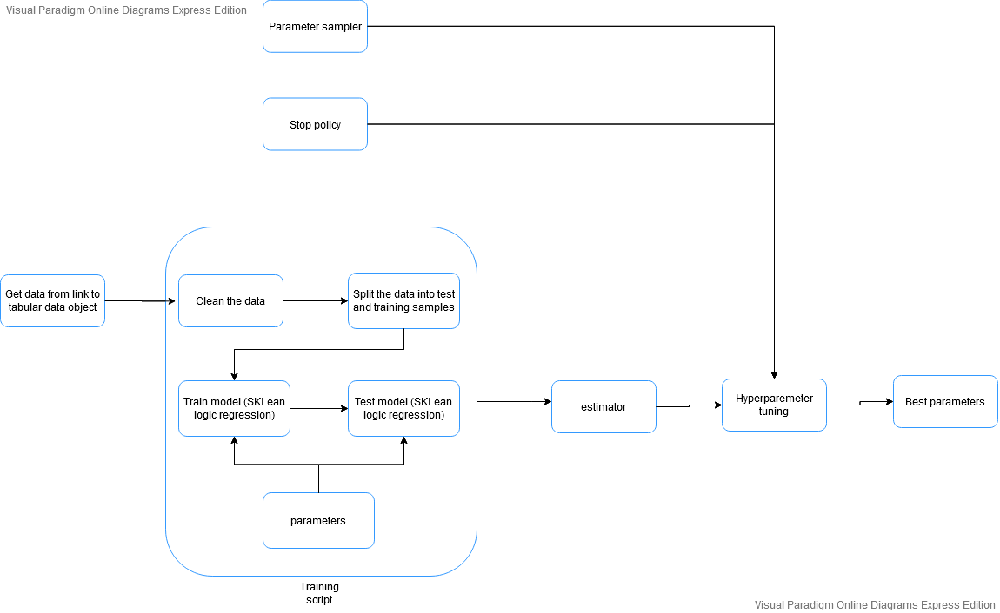
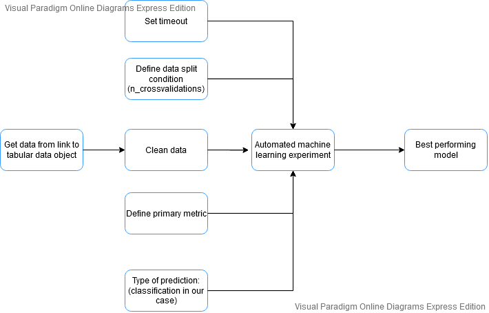

# Optimizing an ML Pipeline in Azure

## Overview
This project is part of the Udacity Azure ML Nanodegree.
In this project, we build and optimize an Azure ML pipeline using the Python SDK and a provided Scikit-learn model.
This model is then compared to an Azure AutoML run.

## Summary
**In 1-2 sentences, explain the problem statement: e.g "This dataset contains data about... we seek to predict..."**
This dataset contains data about clients advertised during a marketing campaign organized by a bank. We seek to predict wether or not the clients end up registering for the advertised product. The data collected from the clients include several information like about their account, how often they were reached about the product, the medium used to reach them and ultimately their final decision (go for the product or not).

**In 1-2 sentences, explain the solution: e.g. "The best performing model was a ..."**
The best performing model was the ``VotingEnsemble``, which is the result for running automated machine learning.
This model is able to accurately predict the result with a ``91.709%`` accuracy against only ``91.608%`` by our hypertuned Logic regression model.

## Scikit-learn Pipeline
**Explain the pipeline architecture, including data, hyperparameter tuning, and classification algorithm.**

Here is diagram representing the architecture of our hyperparemeter tuning:


There are several steps we need to take to hypertune a model for a given dataset.
- We first need to get the dataset. In our case the data set is found [here](...). This data is in a tabular form so we parse it as such using azure ``TabularDatasetFactory``
- Now that we have our data. The next step to take is to clean it. We convert all the binary column (containing 'yes' and no's) to '0' and 1's. We also extract the label (or column) we are trying to predict, in our case the column 'y'.
- We split the cleaned data into training and testing samples. 20% of our data is used for training. We achieve this, we use scikit-learn ``train_test_split`` method
- We setup the parameter spaces for the parameters of our model (``LogicRegression``) we are trying to tune. In our case we are trying to get a good value for the ``Inverse of regularization strength: --C`` and ``The maximum number of iteration: --max_iter``. We use a uniform space of ``--C`` and a discrete space of ``--max_iter``.
- We define a stop condition or policy. In our case we want to stop tuning when there is a drop of ``0.2%`` in accuracy.
- We Create our hyperparameter configuration object with our estimator (which define where our script is located), our parameter sampler, our stop policy and finaly the metric we are tuning for in our case ``accuracy``.
- We submit configuration and run our experiment.
- We extract the best performing model parameters, after the run is completed and save them.

**What are the benefits of the parameter sampler you chose?**
We use a ``random parameter sampler``. There are three sampling methods available to us:
the ``randome parameter`` approach, the ``grid samping`` approach and the ``bayesian`` approach. 
- The ``Grid sampling`` approach is very exhaustive. It considers all the possible combination of parameters possible, so it can be very time consumming. 
- The ``Bayesian`` approach is intelligent, it tries to logicaly determine the next values to be assigned to our parameters. But this method does not support a stop policy.
- The ``Random parameter`` approach just randomly picks value from the spaces provided. So it can very efficient compare to the others (in picking a value).

In our case we use ``RandomParameterSampling`` because of how efficient it is compare to the others.

**What are the benefits of the early stopping policy you chose?**

We use the early stopping policy to stop our experiment when there is a considerable drop in ``accuracy`` (the metric we are tuning for). What we consider considerable in our case is 0.1% which we check for after 2 normal interations.

## AutoML
**In 1-2 sentences, describe the model and hyperparameters generated by AutoML.**
The VotingEnsemble is a very powerful model, it bases its predictions on several other models by taking a weighted average of their results. Out of all the models considered, the voting ensemble used several including: ``LightGBM classifier (MaxAbsScaler) `` with a weight of ``0.15384615384615385``. This model is hypertuned by auto ml. The hyperameters determined by automl for this model include:
```
 {
    'boosting_type': 'goss',
    'class_weight': None,
    'colsample_bytree': 0.5944444444444444,
    'importance_type': 'split',
    'learning_rate': 0.04211105263157895,
    'max_bin': 330,
    'max_depth': 4,
    'min_child_samples': 1251,
    'min_child_weight': 6,
    'min_split_gain': 0.9473684210526315,
    'n_estimators': 200,
    'n_jobs': 1,
    'num_leaves': 230,
    'objective': None,
    'random_state': None,
    'reg_alpha': 0.894736842105263,
    'reg_lambda': 0.3157894736842105,
    'silent': True,
    'subsample': 1,
    'subsample_for_bin': 200000,
    'subsample_freq': 0,
    'verbose': -10
 }
```
If we consider the ``boosting_type``, ``n_estimators`` and ``learning_rate``: 
- ``boosting_type`` refers to the type of boosting algorithm used. They are several values for this parameter including ``gbdt``, ``rf``, ``dart`` and ``goss``, the default value being (``gbdt``: traditional Gradient Boosting Decision Tree). check this [link](https://lightgbm.readthedocs.io/en/latest/Parameters.html#boosting) for more information. In this run ``goss`` is used instead which is the:  Gradient-based One-Side Sampling.
- ``n_estimators`` represents the number of boosting iterations and is set to ``100`` by default, but for this run we can see that automl attempts to run the model with ``n_estimators`` set to ``200``
- ``learning_rate`` which is also known as skrinkage rate and has a default value of ``1.0`` but in this run it is set to `` 0.04211105263157895``

Automl tries to optimize the value for this parameters for this model in its run.

Here are some metrics of our votingEnsemble model:


## Pipeline comparison
**Compare the two models and their performance. What are the differences in accuracy? In architecture? If there was a difference, why do you think there was one?**
The VotingEnsemble model (from our automl run) performs with a ``91.709%`` accuracy which is ``0.101%`` percent more than the hypertuned logic regression: which only has a ``91.608%`` accuracy. The hyparameters determined by our hyperdrive run are ``50`` for the maximum number of iterations and ``2.73645`` for the inverse of regularization strength.

Here is a diagram presenting the architecture of our automl run. 


Automl and hyperparameter tuning have several differences in their architectures.
- How the data is splited into training and testing samples. For our hyperparameter tuning we split the data using the train_test_split function, using 20% as training sample; whereas we use crossvalidation for our automl run. Crossvalidation will use a fraction of the data for training and the rest for testing, several times. For example 5 cross validation means that 1/5 of the data will be used for training and will be cross validated 5 times (5 runs with 1/5training data each time)
- Hyertuning of parameters. Automl does it automatically for all the models considered, whereas hyperparameter tuning is just about tuning the parameter of a single selected model. So automl is much more powerful, tuning several model and picking the best performing one although it requires much more ressources. 

In conclusion when are confident about the best model for our problem or just want to save a lot of compute time, hyperparameter tuning could be the way otherwise automl is. 


## Future work
**What are some areas of improvement for future experiments? Why might these improvements help the model?**
We ran automl using ``accuracy`` as our primary metric. The problem with this is that the data is not really balanced. The data is highly skewed (there are many outliers in our data), we could remove this outliers to improve our predictions because outliers tend to attract the results in thier direction. We could also use metric like ``AUC_weighted``, which smoothens these ouliers. This can grealty help improve the accuracy of our model.

## Proof of cluster clean up
**If you did not delete your compute cluster in the code, please complete this section. Otherwise, delete this section.**
**Image of cluster marked for deletion**
We successfully delete our compute cluster within the notebook, by simply making a call to the delete function avaible to our compute cluster object. 
